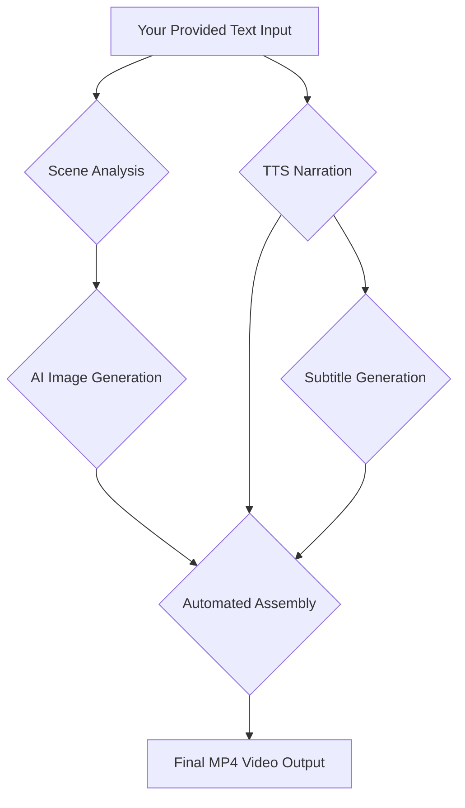

# Refined Text-to-Video Automation Pipeline

This refined plan focuses on taking **your provided text** (either the raw novel chapter or your pre-written script) as the starting point and automatically generating a complete story narration video. This version simplifies the input process and focuses on the core generation and assembly modules.

## 1. Refined Architecture Overview

Since you are providing the text, the pipeline starts directly with your input. It will then automatically handle scene analysis, image generation, narration, and final video assembly, skipping all manual editing steps.



## 2. Module Breakdown for Text-Based Input

### 2.1. Text Processing & Scene Analysis

**Purpose:** To analyze your text and determine where to place different AI-generated images.

**Process:**
1.  Your text is divided into logical segments (e.g., by paragraph or every few sentences).
2.  An LLM (like GPT-4 or local Llama 3) analyzes each segment to generate a descriptive image prompt.
    *   **Prompt to LLM:** "For the following narration segment, create a detailed visual prompt for an AI image generator in a manhwa/anime style: '[Your Segment Text]'"

### 2.2. AI Image Generation (Automated)

**Purpose:** To generate a unique image for each segment of your text.

**Tool:** **Stable Diffusion (Local)** is recommended for full automation and zero cost.
**Process:**
1.  The pipeline automatically feeds each generated prompt into Stable Diffusion.
2.  Images are saved sequentially (e.g., `img_1.png`, `img_2.png`).

### 2.3. TTS Narration & Subtitle Syncing

**Purpose:** To turn your text into audio and generate perfectly timed subtitles.

**Tools:** **Edge-TTS** (free) or **ElevenLabs** (premium) for audio; **OpenAI Whisper** for subtitles.
**Process:**
1.  The pipeline sends your entire text to the TTS engine to generate a single narration audio file.
2.  OpenAI Whisper then analyzes this audio file to generate a `.srt` subtitle file with precise timestamps for every word/phrase.

### 2.4. Automated Video Assembly (The "Skip Manual Editing" Step)

**Purpose:** To combine everything into a finished video without you touching an editor.

**Tool:** **Python `MoviePy`** or a custom **FFmpeg script**.
**Process:**
1.  **Sync Visuals to Audio:** The pipeline uses the timestamps from the Whisper subtitle file to determine exactly how long each image should stay on screen.
    *   *Example:* If your first paragraph takes 10 seconds to read, the first image will be shown for exactly 10 seconds.
2.  **Audio Mixing with Ducking:** Background music is added, and the volume is automatically lowered (ducked) whenever the narration is playing.
3.  **Burn-in Subtitles:** The subtitles are permanently "burned" into the video frames so they appear exactly like the YouTube reference.
4.  **Final Render:** The script renders the final `.mp4` file.

---

## 3. Simplified Implementation Guide

This setup is designed to be a "one-click" script after the initial configuration.

### 3.1. Required Python Setup

```bash
pip install moviepy edge-tts faster-whisper diffusers pydub
# Ensure FFmpeg is installed on your system
```

### 3.2. Core Automation Script (Conceptual)

This Python script would be the heart of your automation. You just place your text in a file and run it.

```python
import edge_tts
import asyncio
from moviepy.editor import *
from faster_whisper import WhisperModel
# ... other imports for image gen ...

async def create_video_from_text(user_text, bg_music_path):
    # 1. Generate Narration Audio
    communicate = edge_tts.Communicate(user_text, "en-US-AvaNeural")
    await communicate.save("narration.mp3")

    # 2. Generate Subtitles (Whisper)
    model = WhisperModel("small")
    segments, _ = model.transcribe("narration.mp3")
    # Save segments to a list with timestamps

    # 3. Generate Images (Conceptual)
    # For each segment in 'segments', call your Stable Diffusion function
    # image_paths = generate_images_for_segments(segments)

    # 4. Assemble Video (MoviePy)
    clips = []
    for i, segment in enumerate(segments):
        duration = segment.end - segment.start
        img_clip = ImageClip(image_paths[i]).set_duration(duration)
        # Add text overlay for subtitles if not burning in with FFmpeg
        clips.append(img_clip)

    final_video = concatenate_videoclips(clips, method="compose")
    
    # Add Audio & Music with Ducking
    narration = AudioFileClip("narration.mp3")
    bg_music = AudioFileClip(bg_music_path).volumex(0.1).set_duration(narration.duration)
    final_audio = CompositeAudioClip([narration, bg_music])
    
    final_video = final_video.set_audio(final_audio)
    final_video.write_videofile("final_story.mp4", fps=24)

# Run the automation
# asyncio.run(create_video_from_text(YOUR_TEXT, "background_music.mp3"))
```

## 4. Why This Skips Step 6

By using the **Whisper timestamps** to drive the **MoviePy assembly**, you never have to manually align images to audio or manually type in subtitles. The script "knows" exactly when to switch images and what text to show on screen based on the audio it generated from your text.

---

## References

[1] Microsoft. (n.d.). *Edge-TTS*. Retrieved from [https://github.com/rany2/edge-tts](https://github.com/rany2/edge-tts)
[2] OpenAI. (n.d.). *Whisper*. Retrieved from [https://openai.com/research/whisper](https://openai.com/research/whisper)
[3] Zulko. (n.d.). *MoviePy*. Retrieved from [https://zulko.github.io/moviepy/](https://zulko.github.io/moviepy/)
[4] Stability AI. (n.d.). *Stable Diffusion*. Retrieved from [https://stablediffusionweb.com/](https://stablediffusionweb.com/)
